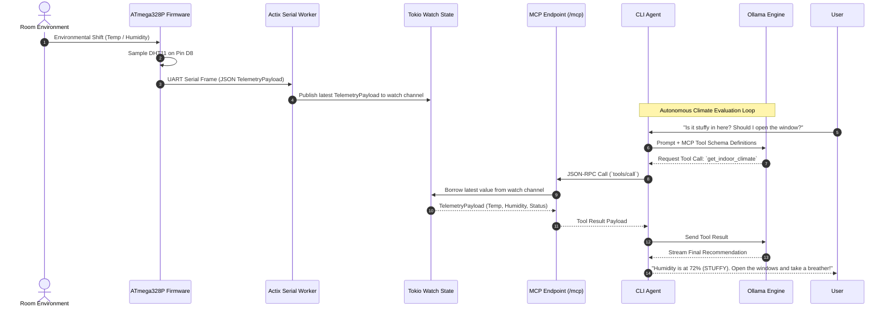

# 空調 — Kūchō

> **Real-Time Embedded Climate Intelligence & MCP Engine**
> _A high-throughput Rust monorepo bridging bare-metal AVR analog sensing with local LLM tool calling via the Model Context Protocol._

---

## Overview

**Kūchō (空調)** is an autonomous indoor climate monitoring and decision-making system. Built as a unified Cargo workspace, it captures room metrics via an **ATmega328P** (Arduino Uno) sensor node, streams telemetry real-time over 57600 baud UART into an **Actix Web** backend, exposes metrics as **Model Context Protocol (MCP)** tools, and feeds contextual telemetry into a local **Ollama** instance via a dedicated CLI agent for real-time room atmosphere reasoning.

---

## The Why

Working indoors for long stretches makes it easy to forget to open windows and maintain healthy indoor humidity levels. Regardless of whether air conditioning is available, natural ventilation is cost-effective, practical, and maintains a comfortable room environment.

More importantly, **Kūchō** serves as a natural prompt to take regular breaks: stepping out onto the balcony, taking in green surroundings, resetting, and stepping away from the screen to boost morale and spark new ideas. Instead of checking manual gauges or sensor apps, you can simply ask your local LLM if the room needs ventilation. The AI queries Kūchō's underlying MCP tools in real-time, evaluates humidity thresholds, and gives you an instant verdict on whether it's time to open the windows and take a breather.

---

## Core Features

- **Bare-Metal Hardware Ingestion:** Real-time UART serial frame parsing from custom AVR Rust firmware directly into non-blocking `tokio::sync::watch` state channels.
- **Model Context Protocol (MCP) Engine:** Native JSON-RPC tool endpoints (`/mcp`) exposing real-time hardware telemetry (`get_indoor_climate`) directly to local LLMs.
- **Native CLI Agent:** Interactive, streaming terminal client in Rust (`cli-agent`) that bridges local Ollama models with your hardware backend via MCP tool calls.
- **Dual `#![no_std]` Domain Core:** Shared `weather-core` domain crate compiles cleanly for bare-metal microcontrollers (`avr-atmega328p`) and 64-bit host systems.
- **Complete LGTM Telemetry Stack:** Structured JSON logging, tracing, and metrics gathered via Grafana Alloy into Loki, Tempo, and Grafana.

---

## System Architecture
```mermaid
graph TB
    subgraph Hardware Layer ["Hardware Layer (Microcontroller)"]
        DHT["DHT11 Sensor<br/><i>Digital Pin D8</i>"]
        AVR["ATmega328P / Arduino Uno<br/><code>firmware-avr</code>"]
        DHT -->|1-Wire Bit-Bang Protocol| AVR
    end

    subgraph Host Server ["Kūchō Actix Server"]
        SERIAL["Serial Ingestion Worker<br/><code>57600 Baud UART</code>"]
        STATE["In-Memory Watch Channel<br/><code>tokio::sync::watch</code>"]
        REST["REST Telemetry Endpoint<br/><code>/api/v1/telemetry</code>"]
        MCP["MCP Server Endpoint<br/><code>/mcp</code>"]

        SERIAL -->|Parse JSON Frame| STATE
        STATE -->|Read Latest Snapshot| REST
        STATE -->|Read Latest Snapshot| MCP
    end

    subgraph Agent Layer ["Local AI Agent Layer"]
        CLI["CLI Agent Crate<br/><code>cli-agent</code>"]
        OLLAMA["Ollama LLM Engine<br/><i>Local Inference (Qwen)</i>"]

        CLI <===>|JSON-RPC Tool Calls| MCP
        CLI <===>|Prompts & Tool Responses| OLLAMA
    end

    subgraph Observability ["Observability Stack (Docker)"]
        ALLOY["Grafana Alloy<br/><i>OTLP Collector</i>"]
        LOKI["Grafana Loki"]
        TEMPO["Grafana Tempo"]
        GRAFANA["Grafana Dashboards"]

        Host Server -.->|Traces / Bunyan Logs| ALLOY
        ALLOY --> LOKI
        ALLOY --> TEMPO
        ALLOY --> GRAFANA

```

---

## Real-Time Sequence Flow



---

## Workspace & Directory Structure

```
kucho-1/
├── Justfile                      # Command runner for build, flash, and stack setup
├── Cargo.toml                    # Workspace manifest & profile overrides
├── Cargo.lock
├── rust-toolchain.toml           # Toolchain pinning
│
├── weather-core/                 # Shared #![no_std] Domain Logic & DTOs
│   ├── Cargo.toml
│   └── src/
│       ├── lib.rs                # #![cfg_attr(not(feature = "std"), no_std)]
│       ├── domain.rs             # Value objects & rules (OPTIMAL, STUFFY, HIGH_HUMIDITY)
│       └── protocol.rs           # Serde-compatible JSON telemetry frames
│
├── firmware-avr/                 # ATmega328P Bare-Metal Firmware
│   ├── Cargo.toml
│   ├── Ravedude.toml             # Flashing & serial config runner
│   ├── avr-atmega328p.json       # Custom target specification
│   ├── rust-toolchain.toml
│   └── src/
│       ├── main.rs               # Sampling loop & UART streaming
│       └── dht11.rs              # Bit-bang 1-wire DHT11 driver
│
├── weather-actix-server/         # Async Web Server & MCP Engine
│   ├── Cargo.toml
│   ├── src/
│   │   ├── main.rs               # Entry point (spawns worker, binds server)
│   │   ├── lib.rs                # Exported application module for tests
│   │   ├── handlers.rs           # REST API endpoints
│   │   ├── serial.rs             # Async Tokio serial reader loop
│   │   ├── mcp.rs                # MCP Tool Definitions & JSON-RPC server
│   │   └── telemetry.rs          # OpenTelemetry & Bunyan tracing setup
│   └── tests/                    # Black-Box Integration Tests
│       ├── e2e_pipeline.rs
│       ├── mcp_endpoint.rs
│       └── telemtry_endpoint.rs
│
├── cli-agent/                    # Local AI Interactive Agent
│   ├── Cargo.toml
│   └── src/
│       ├── main.rs               # CLI loop & streaming output
│       └── agent.rs              # Ollama integration & MCP RPC client
│
└── deployment/                   # Homelab LGTM Observability Stack
    ├── Dockerfile.server         # Production multi-stage build
    ├── docker-compose.yml        # Local stack: Grafana, Loki, Tempo, Alloy
    ├── alloy/                    # Grafana Alloy OTLP collector pipeline
    ├── grafana/                  # Datasource provisioning
    └── tempo/                    # Distributed tracing config

```

---

## Hardware Specifications

| Component                  | Specification                                   |
| -------------------------- | ----------------------------------------------- |
| **Microcontroller Target** | ATmega328P (Arduino Uno)                        |
| **Architecture**           | 8-bit AVR (`avr-atmega328p`)                    |
| **Primary Sensor**         | DHT11 Temperature & Humidity Sensor             |
| **Data Pin**               | Digital Pin **D8**                              |
| **Heartbeat Indicator**    | Digital Pin **D13** (Toggles on sampling cycle) |
| **Telemetry Transport**    | 57600 Baud UART Serial over USB                 |

---

## Quickstart Guide

### 1. Hardware Firmware Flash

Plug in your Arduino Uno via USB and flash the release binary using `ravedude`:

```bash
cd firmware-avr
cargo +nightly -Zbuild-std=core,panic_abort -Zjson-target-spec run --release

```

### 2. Start Backend Server

Run the Actix ingestion server to capture serial streams and expose REST/MCP endpoints:

```bash
cargo run -p weather-actix-server

```

### 3. Trigger the AI CLI Agent

In a separate terminal, trigger the local streaming agent (ensuring local Ollama instance is running):

```bash
cargo run -p cli-agent

```

### 4. Deploy Observability Stack

Spin up Grafana, Loki, Tempo, and Alloy using Docker Compose or `just`:

```bash
docker compose -f deployment/docker-compose.yml up -d

```

---

## Testing

Run black-box integration tests for telemetry ingestion and MCP tool endpoint validation:

```bash
cargo test -p weather-actix-server

```
