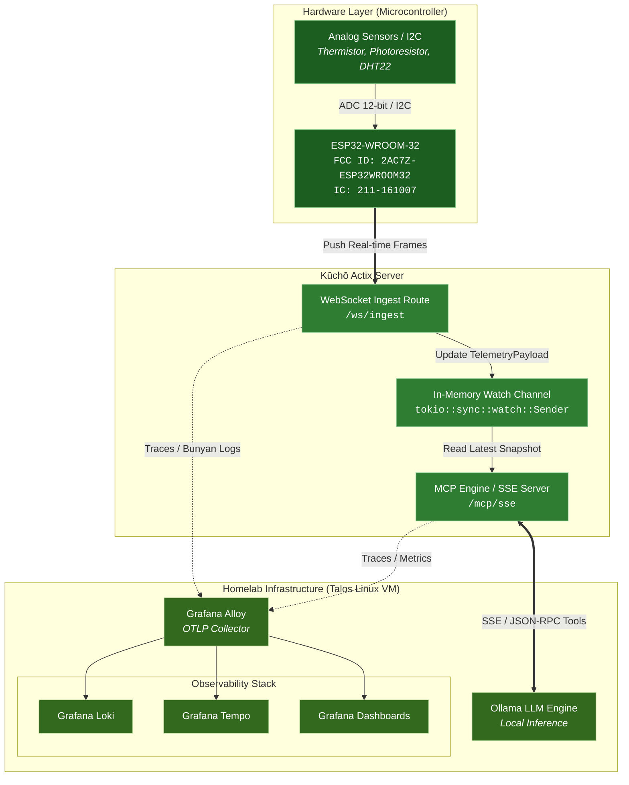
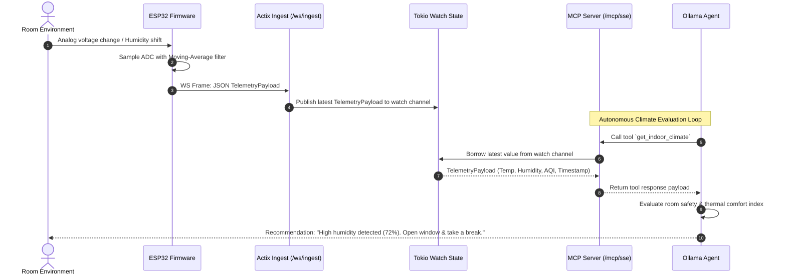

# 空調 — Kūchō

> **Real-Time Embedded Climate Intelligence & MCP Engine**
> _A high-throughput Rust monorepo bridging embedded analog sensing on Talos Linux homelab infrastructure with local LLM tool calling via the Model Context Protocol._

---

## Overview

**Kūchō (空調)** is an autonomous indoor climate monitoring and decision-making system. Built as a unified Cargo workspace, it captures physical room metrics via an **ESP32-WROOM-32** sensor node, streams telemetry real-time over persistent WebSockets into an **Actix Web** backend, exposes metrics as **Model Context Protocol (MCP)** tools, and feeds contextual data into a local **Ollama** instance for dynamic home automation reasoning.

---

## The Why

Working indoors for long stretches makes it easy to forget to open windows and maintain healthy indoor humidity levels. Regardless of whether air conditioning is available, natural ventilation is cost-effective, practical, and maintains a comfortable room environment.

More importantly, **Kūchō** serves as a natural prompt to take regular breaks: stepping out onto the balcony, taking in the green surroundings, resetting, and stepping away from the screen to boost morale and spark new ideas. Instead of checking manual gauges or sensor apps, you can simply ask your local LLM if the room needs ventilation. The AI queries Kūchō's underlying MCP tools in real-time, evaluates humidity thresholds, and gives you an instant verdict on whether it's time to open the windows and take a breather.

---

## Core Features

- **Zero-Polling Real-Time Telemetry:** Long-lived WebSocket stream push from ESP32 firmware directly into Tokio asynchronous channels.
- **Production-Grade Architecture:** Backend designed to production standards (explicit configuration layers, black-box integration tests, decoupled application startup).
- **Dual `#![no_std]` Core:** `weather-core` domain crate compiles for both microcontrollers (`xtensa-esp32-espidf` / `bare-metal`) and 64-bit Linux server targets.
- **Ollama MCP Integration:** Native Server-Sent Events (SSE) transport exposing structured tool schemas (`get_indoor_climate`, `recommend_window_state`).
- **Complete LGTM Telemetry:** OTLP traces, metrics, and structured JSON logs gathered via Grafana Alloy into Loki, Tempo, and Grafana.

---

## System Architecture



---

## Real-Time Sequence Flow



---

## Workspace & Directory Structure

```
kucho-monorepo/
├── Cargo.toml                    # Workspace manifest defining all crates
├── Cargo.lock
├── Justfile                      # Command runner (build, flash, test, alloy-up)
│
├── crates/
│   ├── weather-core/             # Shared #![no_std] Domain Logic & DTOs
│   │   ├── Cargo.toml
│   │   └── src/
│   │       ├── lib.rs            # #![cfg_attr(not(feature = "std"), no_std)]
│   │       ├── domain/           # Value objects (Temperature, Humidity, SafetyStatus)
│   │       └── protocol.rs       # Serde-compatible JSON telemetry frames
│   │
│   ├── esp32-firmware/           # ESP32 Embedded Binary (xtensa-esp32-espidf)
│   │   ├── Cargo.toml
│   │   ├── build.rs              # ESP-IDF linker script generator
│   │   ├── sdkconfig.defaults    # Wi-Fi stack & NVS parameters
│   │   └── src/
│   │       ├── main.rs           # FreeRTOS tasks & streaming event loop
│   │       ├── sensors/          # 12-bit ADC / I2C sensor readers
│   │       └── ws_client.rs      # Persistent WebSocket client stream pusher
│   │
│   └── weather-actix-server/     # Web Server & MCP Engine (Zero2Prod Style)
│       ├── Cargo.toml
│       ├── configuration.yaml    # Environment configurations (local/prod)
│       ├── src/
│       │   ├── main.rs           # Entry point (spawns telemetry, binds server)
│       │   ├── lib.rs            # Application builder logic exported for tests
│       │   ├── startup.rs        # HttpServer initialization & listener binding
│       │   ├── configuration.rs  # Structured configuration loader
│       │   ├── telemetry.rs      # Tracing / OpenTelemetry / Bunyan formatter setup
│       │   ├── state.rs          # Arc<AppState> wrapper for Tokio watch channel
│       │   ├── routes/
│       │   │   ├── mod.rs
│       │   │   ├── health_check.rs
│       │   │   └── ws_ingest.rs  # Real-time WebSocket frame ingestion route
│       │   └── mcp/              # MCP Server Protocol Engine
│       │       ├── mod.rs
│       │       ├── server.rs     # SSE Transport & JSON-RPC parser
│       │       └── tools.rs      # Tool definitions (get_indoor_climate)
│       └── tests/
│           └── api/              # Black-box Zero2Prod integration tests
│               ├── helpers.rs    # Random port app spawner & test harness
│               ├── health_check.rs
│               └── ingest.rs
│
└── deployment/                   # Homelab LGTM Observability Stack
    ├── docker-compose.yml        # Local stack: Grafana, Loki, Tempo, Alloy
    └── alloy/
        └── config.alloy          # OTLP metrics/traces pipeline config

```

---

## Hardware Specifications

| Component                  | Specification                                          |
| -------------------------- | ------------------------------------------------------ |
| **Microcontroller Target** | ESP32-WROOM-32                                         |
| **FCC ID**                 | `2AC7Z-ESP32WROOM32`                                   |
| **IC Certification**       | `211-161007`                                           |
| **Architecture**           | Xtensa® Dual-Core 32-bit LX6                           |
| **Analog Read Resolution** | 12-bit SAR ADC (0–4095 raw values)                     |
| **Telemetry Transport**    | Wi-Fi 802.11 b/g/n (Persistent WebSocket frame stream) |

---

## Observability & Telemetry (LGTM Stack)

Kūchō uses **Grafana Alloy** as a central OTLP collector embedded directly inside the deployment pipeline:

- **Logs:** Actix logs are formatted as structured JSON via `tracing-bunyan-formatter` and shipped to **Loki**.
- **Traces:** Application spans are propagated using `tracing-opentelemetry` via gRPC (`:4317`) into **Tempo**.
- **Metrics:** Server connection state, active WebSocket clients, and sensor buffer latencies are exported to **Grafana**.

---

## Quick Start

### 1. Requirements

- Rust toolchain (nightly or stable 1.80+)
- `espup` & `ldproxy` (for ESP32 embedded compilation)
- `just` command runner
- Docker & Docker Compose (for LGTM stack)

### 2. Run Local Observability Stack

```bash
just alloy-up

```

### 3. Run Actix Server with Telemetry

```bash
RUST_LOG=info cargo run -p weather-actix-server

```

### 4. Flash ESP32 Firmware

Connect the ESP32-WROOM-32 via USB and execute:

```bash
just flash-esp32 /dev/ttyUSB0

```

### 5. Run Integration Tests

```bash
cargo test -p weather-actix-server

```
