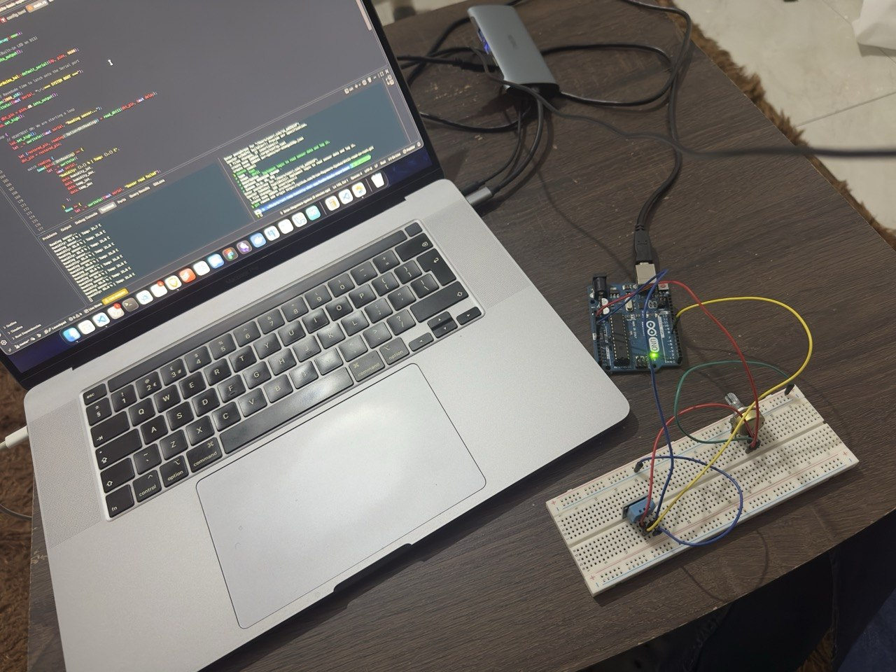

# Kūchō Hardware Setup

This document describes the hardware configuration used by the current Kūchō
firmware.

## Tested hardware

The current firmware targets:

- Arduino Uno
- ATmega328P
- DHT11 temperature and humidity sensor
- USB cable for serial communication and power
- jumper wires

The firmware target is defined for the ATmega328P and uses the Arduino Uno HAL.

## Wiring

The current firmware expects the DHT11 data line on Arduino digital pin `D8`.

| DHT11 | Arduino Uno |
| ----- | ----------- |
| VCC   | 5V          |
| DATA  | D8          |
| GND   | GND         |

The firmware configures the DHT11 data pin with a pull-up while reading the
sensor.

> If you are using a bare 4-pin DHT11 rather than a breakout module, check the
> sensor/module documentation before wiring it. Pin order can differ between a
> bare sensor and modules that include supporting components.

## Heartbeat LED

Arduino pin `D13` is used as a heartbeat indicator.

The firmware toggles this LED during the main sampling loop. If the firmware is
running, you should see the onboard LED change state as sensor readings are
attempted.

This is useful for distinguishing:

```text
firmware is running
```

from:

```text
firmware never started / board was not flashed
```

## Sampling and telemetry

The Arduino reads the DHT11 and sends telemetry over its USB serial connection.

Current serial configuration:

```text
Baud rate: 57600
```

Each successful reading is emitted as a JSON telemetry frame containing:

```text
temperature integer byte
temperature decimal byte
humidity integer byte
humidity decimal byte
safety status
```

The DHT11 itself supplies separate integer and decimal bytes. Kūchō preserves
that representation on the firmware side rather than introducing unnecessary
floating-point work on the ATmega328P.

The firmware samples approximately every two seconds.

## Physical layout

A minimal setup looks like:

```text
          DHT11
       ┌─────────┐
       │         │
       │ VCC     ├──────────── 5V
       │ DATA    ├──────────── D8
       │ GND     ├──────────── GND
       │         │
       └─────────┘
                         Arduino Uno
                    ┌──────────────────┐
                    │                  │
                    │ D8   ← sensor    │
                    │ D13  ← heartbeat │
                    │                  │
                    └────────┬─────────┘
                             │
                             │ USB
                             ▼
                        Host machine
```

## Build the firmware

From the Kūchō repository root:

```bash
just check-firmware
```

Then:

```bash
just build-firmware
```

## Flash the Arduino

Connect the Arduino by USB and identify its serial device.

### Ubuntu

```bash
ls /dev/ttyACM* /dev/ttyUSB* 2>/dev/null
```

Example:

```text
/dev/ttyACM0
```

### macOS

```bash
ls /dev/cu.*
```

Example:

```text
/dev/cu.usbmodem1101
```

Configure it:

```bash
export SERIAL_PORT=<your-device>
```

Then flash:

```bash
just flash
```

## Verify the board

After flashing:

1. The onboard `D13` LED should toggle while the main loop runs.
2. The server should be able to open the board's serial device.
3. Valid telemetry should eventually appear from the API.

Start the server:

```bash
just server "$SERIAL_PORT"
```

Then in another terminal:

```bash
curl http://127.0.0.1:8080/api/v1/telemetry
```

A successful response should resemble:

```json
{
  "temp_int": 23,
  "temp_dec": 0,
  "humidity_int": 51,
  "humidity_dec": 0,
  "status": "OPTIMAL"
}
```

## Sensor errors

The firmware validates the DHT11 checksum before accepting a reading.

If communication fails, the serial stream may contain errors such as:

```text
TIMEOUT
CHECKSUM_MISMATCH
```

If this happens, check:

- sensor power;
- ground;
- the D8 data connection;
- jumper-wire continuity;
- sensor orientation/pin order.

## Hardware photo

A photo of the tested Kūchō prototype can be added here:

```markdown

```

## Kūchō prototype

This is the hardware configuration used for the current Kūchō prototype:


Recommended repository location:

```text
docs/images/kucho-weather-station.jpg
```

A real photo is preferable to a generic internet wiring image because it shows
the exact tested build.

## Changing the sensor pin

The DHT11 pin is currently configured in:

```text
firmware-avr/src/main.rs
```

as Arduino digital pin:

```text
D8
```

If you move the sensor to another pin, update the firmware and reflash the
Arduino.

## Related documentation

- [`setup-ubuntu.md`](setup-ubuntu.md)
- [`setup-macos.md`](setup-macos.md)
- [`architecture.md`](architecture.md)
- [`troubleshooting.md`](troubleshooting.md)
